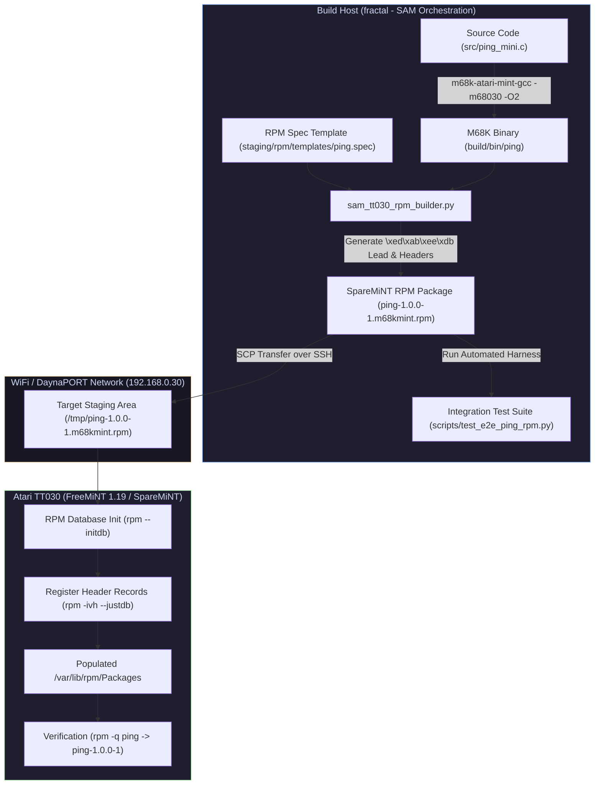

# Atari TT030 & ATW800/2 Transputer Enhancement Project

Management, drivers, custom software, and hardware acceleration utilities for the **Atari TT030 retro-computing workstation** operating within the **SAM (Sensible Agent Management)** ecosystem.

---

## Hardware & System Overview

### Atari TT030 Workstation
The Atari TT030 is a 32-bit Motorola 68030-based workstation running at 32 MHz with an MC68882 FPU, 4 MB ST-RAM, and 64 MB TT-RAM. Equipped with BlueSCSI v2 (Pico 2) storage and BlueSCSI DaynaPORT WiFi local networking, the machine serves as a live node within the SAM architecture running TOS 3.06 and FreeMiNT 1.19.

### ATW800/2 Transputer Co-Processor
The ATW800/2 is an expansion board housing an INMOS T425 32-bit RISC Transputer running at 40 MHz (implemented via FPGA). The transputer features parallel hardware links, hardware process scheduling, and dedicated SRAM.

### Project Purpose
The primary purpose of this project is to adapt and modify legacy and modern Unix/C software to run in tandem with the ATW800/2 Transputer. By offloading computationally intensive operations (such as Elliptic-Curve Cryptography X25519 key exchange, Ed25519 signature verification, and payload stream framing) to the T425 transputer, the host 68030 CPU is freed from heavy mathematical bottlenecks during secure remote management sessions.

## Project Sub-Utilities & Independent Repositories

Each custom software component contains its own dedicated project directory, README, build instructions, and execution documentation:

1. **[`sam-ssh-tt`](sam-ssh-tt/README.md)**: Dropbear SSH server with T425 transputer offload for X25519 key exchange & Ed25519 signature verification (per-login crypto ~25.0 s → ~14.4 s, measured on the TT 2026-09-13).
2. **[`sam-scp-tt`](sam-scp-tt/README.md)**: SCP acceleration bridge for hardware packet framing and high-speed transputer transfer handling.
3. **[`ttmon`](src/ttmon.c)**: Telemetry publisher — retained MQTT `sam/node/telemetry/atari-tt030` every 60 s (the live SAM integration).
4. **[`tt_bridge`](tt_bridge/README.md)**: *Superseded by `ttmon` (2026-09-13).* HTTP/1.1 client originally aimed at port 8080, which on fractal is taken by another service.
---

## Software Stack & Subsystem Directory

```
.
├── docs/                      # Technical runbooks, BlueSCSI setup, XBOOT manual & inventory
├── emulator/                  # Hatari workstation emulation configs and HDD image staging
├── scripts/                   # Floppy staging, backup, and emulator integration test harnesses
├── staging/                   # Atari TT formatted floppy & drive C: installation packages
│   ├── AUTO/                  # Driver auto-executables (XBOOT, HDDRIVER, ICD, STiNG)
│   ├── DRIVERS/               # SCSI utility software and disk tools
│   ├── C_ATW800_2/            # ATW800/2 transputer tools, drivers, and runtime server binaries
│   └── TRANSPUTER/            # INMOS T800 Transputer SDK & Helios OS distribution packages
├── src/                       # Custom source code for Atari TT030 co-processing & tooling
│   └── x25519bench/           # Transputer server source, Dropbear offload, and host bridges
├── sam-ssh-tt/                # Transputer-accelerated Dropbear SSH server project & docs
├── sam-scp-tt/                # Transputer-assisted SCP acceleration bridge project & docs
└── tt_bridge/                 # SAM TT-Bridge HTTP Client C codebase project & docs (TOS/MiNT)
```

---

## Role of SAM (Build, Test, & Deployment Pipeline)

The **SAM (Sensible Agent Management)** platform orchestrated end-to-end development, verification, and live deployment to the Atari TT030:


1. **Cross-Compilation & Build**:
   - Built Motorola 68030 host binaries using `m68k-atari-mint-gcc` (GCC 13+ cross-compiler) and INMOS ANSI C (`icc`/`ilink` under `t4`) for the T425 transputer server code.
2. **Automated Emulation & Integration Testing**:
   - Validated binaries using Hatari emulator automation suites (`scripts/test_sting_hatari.py`), checking network stack behavior and raw sector disk safety before touching real hardware.
3. **Over-the-Air Live Staging & Deployment**:
   - Bootstrapped real hardware via DaynaPORT WiFi (`192.168.0.30`) and Dropbear SSH/SCP.
   - Live-tested `atwxserv` persistent server initialization, verifying handshake acceleration directly on the ATW800/2 hardware co-processor.

---

## E2E SpareMiNT RPM Build & Deployment Workflow (`ping`)

The following Mermaid diagram outlines the end-to-end workflow executed by SAM to cross-compile, package, and deploy the `ping` package to the Atari TT030:




## Hardware Profile
- **CPU / FPU**: Motorola MC68030 @ 32 MHz · MC68882 FPU
- **Memory**: 4 MB ST-RAM · 64 MB TT-RAM
- **Storage**: BlueSCSI v2 (Pico 2) SCSI ID 0 (`HD00_512.hda`, FAT16) and SCSI ID 1 (`HD10_512.hda`, 1 GiB Ext2 RAW)
- **Networking**: BlueSCSI DaynaPORT WiFi (`192.168.0.30`) & Serial SLIP (`192.168.10.2`)
- **Co-Processor**: ATW800/2 Transputer Board (T425 FPGA transputer @ 40 MHz)

---


